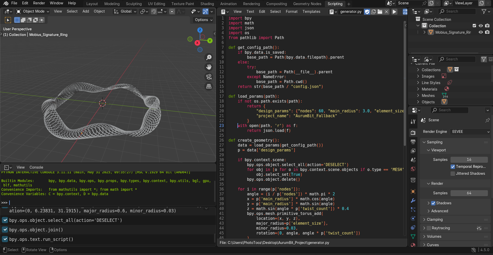

# AurumBit: Where Economic Cybernetics Meets Luxury Design

### Hi, I'm David

AurumBit is my attempt to bridge the gap between abstract mathematical bits and the physical world of luxury goods. Coming from a background in **Economic Cybernetics**, I’ve always been fascinated by how data and algorithms can optimize traditional, labor-intensive industries.

### The Problem with Luxury
Traditional jewelry design is often stuck in a binary choice: either mass-produced via static molds or handcrafted at an unscalable pace. There is a missing middle-a way to create unique, complex, and organic forms that are driven by data rather than manual labor.

### The Solution: An Algorithmic Engine & Professional Architecture
Instead of modeling shapes by hand, I am building an engine in Python that "calculates" jewelry. By using the Blender API, I treat 3D space as a mathematical canvas. 

**Recent Architectural Upgrade:** I have evolved the project from a simple script into a professional software repository. The engine now follows a **Decoupled Architecture**, separating the geometric logic from the design parameters.

### Current Status: Engine Foundation & CI/CD Integration
Right now, AurumBit is in its **Engine Foundation** phase, moving towards a robust production pipeline.

- **Automated Quality Assurance (CI/CD):** Every code change is automatically validated using **GitHub Actions**. A cloud-based pipeline installs a headless Blender environment to check for syntax errors and logic consistency before any deployment.
- **Data-Driven Design:** The engine is acum fully parametric. It listens to an external `config.json` file. This means I can transform an entire collection (from a "Cyberpunk Ring" to a "Mobius Signature") by simply adjusting data points, without modifying the source code.
- **Cross-Platform Robustness:** Using advanced path-handling (`pathlib`), the engine is now portable, running seamlessly on local Windows machines, Linux servers, or within Blender's internal environment.

---

## The Roadmap: From Code to Gold

I don't just want to make "cool shapes". I am building a full-cycle generative pipeline.

#### Phase 1: Geometric Synthesis (Current)
Developing the library of algorithms (Voronoi, Fibonacci spirals, and L-systems) that define the "AurumBit style."

#### Phase 2: The AI Interpreter (Next Step)
Integrating an LLM bridge to translate natural language prompts into the JSON parameters my engine requires. The goal is to let a user describe a feeling or an inspiration and have the engine calculate the perfect geometric response.

#### Phase 3: Physical Validation & Export
Optimizing the generated meshes specifically for high-precision 3D printing and lost-wax casting. A design is only successful if it can actually be held in one's hand :)

### Technical Stack
- **Core Logic:** Python (Blender API / `bpy`).
- **DevOps/CI/CD:** GitHub Actions, Flake8.
- **Environment:** Pathlib for cross-platform file management.
- **Data Structure:** JSON-based parameter mapping.
- **Mathematics:** Vector calculus and parametric geometry.

---
*AurumBit is a Work in Progress. It represents my journey into Deep Tech-proving that with enough code, we can turn a bit of information into a piece of gold.*
